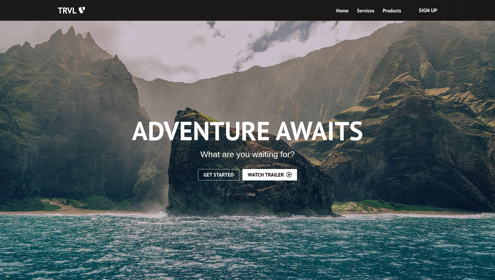

<h1 align="center">React Travel Website</h1>

## Table of Contents

- [Overview](#overview)
  - [Built With](#built-with)
- [How to use](#how-to-use)
- [Acknowledgements](#acknowledgements)
- [Credit](#credit)
- [Contact](#contact)

## Overview




### Built With

- [React](#built-with)

## How To Use

To clone and run this application, you'll need [Git](https://git-scm.com) and [Node.js](https://nodejs.org/en/download/) (which comes with [npm](http://npmjs.com)) installed on your computer. From your command line:
## Clone this repository
```bash
git clone https://github.com/saadman-galib/react-travel-website.git
```
## Install dependencies
```bash
npm install
```
## Run the app
```bash
npm start
```


## Acknowledgements

- [Steps to replicate a design with React](#acknowledgements)

## Credit
I have made this project by following the tutorials of [Brian Design](https://www.youtube.com/channel/UCsKsymTY_4BYR-wytLjex7A).

## Contact

- GitHub [@saadman-galib](https://www.github.com/saadman-galib)
- Twitter [@GalibSaadman](https://www.twitter.com/GalibSaadman)
- Facebok Page [@Saadman Codes](https://www.facebook.com/saadman.codes/)